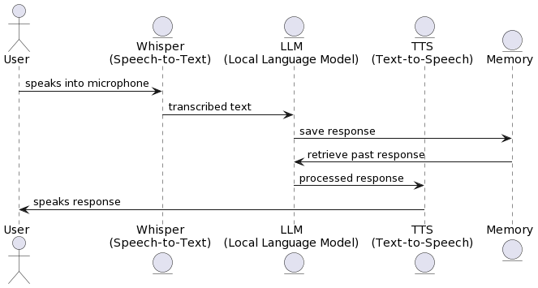

# VoiceAI whisper-llm-gtts

## Overview

VoiceAI integrates the power of Text-to-Speech (TTS), Speech-to-Text (STT), and Local Language Model (LLM) technologies. This advanced AI application enables seamless conversion of text to speech, transcription of audio to text, and interaction with a local language model through an intuitive interface.

## Demo

The demo was done in gradio app to facilitate use of audio in HF spaces.

[Gradio Demo](https://huggingface.co/spaces/mohcineelharras/alexa-like-assistant)


## Screenshots


## System Flowchart

```plaintext
@startuml
actor User
entity "Whisper\n(Speech-to-Text)" as Whisper
entity "LLM\n(Local Language Model)" as LLM
entity "TTS\n(Text-to-Speech)" as TTS
entity "Memory" as Memory

User -> Whisper : speaks into microphone
Whisper -> LLM : transcribed text
LLM -> Memory : save response
Memory -> LLM : retrieve past response
LLM -> TTS : processed response
TTS -> User : speaks response
@enduml
```



## Getting Started

### Prerequisites

- Python 3.10 or higher
- A GPU for running LLM + Whisper efficiently
- Docker for containerization

### Installation

Clone the project repository:

```bash
git clone git@github.com:mohcineelharras/whisper-llm-gtts.git
cd whisper-llm-gtts
```

Install dependencies:

install ffmpeg

```bash
sudo apt-get install ffmpeg
```

```bash
pip install -r requirements_merged.txt
CMAKE_ARGS="-DLLAMA_CUBLAS=on" pip install llama-cpp-python --force-reinstall --upgrade --no-cache-dir
```

If you encounter issues with GPU acceleration, try installing the CUDA toolkit:

```bash
conda install -c "nvidia/label/cuda-12.1.1" cuda-toolkit
```

### Automatic Environment Setup

Set up the environment using the `.envtemplate` provided, then rename it to `.env`.

To automate the creation of a `conda` environment called `audio` and install dependencies, run:

```bash
./install.sh
```

If you don't have `conda`, use the following script to set it up:

```bash
./install_conda.sh
```

### Model Setup

Create a `models` folder in the root directory, download the desired LLM model, place it in the `models` folder, and adjust the `.env` file accordingly.

## Usage

To try the Gradio demo:

```bash
python app.py
```

To use whisper-llm-gtts, open two terminals:

In the first terminal, activate the `audio` environment and launch FastAPI:

```bash
conda activate audio
cd fastapi
python fastapi/api_server.py
```

In the second terminal, activate the `audio` environment and start the Streamlit frontend:

```bash
conda activate audio
cd streamlit_app
streamlit run streamlit_app/run app.py
```

To run in the terminal:

```bash
bash run_continious.sh
# or
./run_continious.sh
```

## Dockerization

Before building the Docker image, ensure the Docker section in the `.env` file is uncommented. Create a `models` folder and download the model you wish to use.

Build and start the containers using Docker Compose:

```bash
docker-compose up --build
```

## Technologies & Skills

VoiceAI whisper-llm-gtts employs various technologies and showcases multiple skills:

### Libraries

- **FastAPI**
- **Streamlit**
- **Whisper**
- **gTTS (Google Text-to-Speech)**
- **PyTorch**

### Skills

- API Development
- Machine Learning
- Full Stack Development
- Dockerization
- Audio Processing

### Tools

- Docker & Docker Compose
- Git
- Uvicorn


