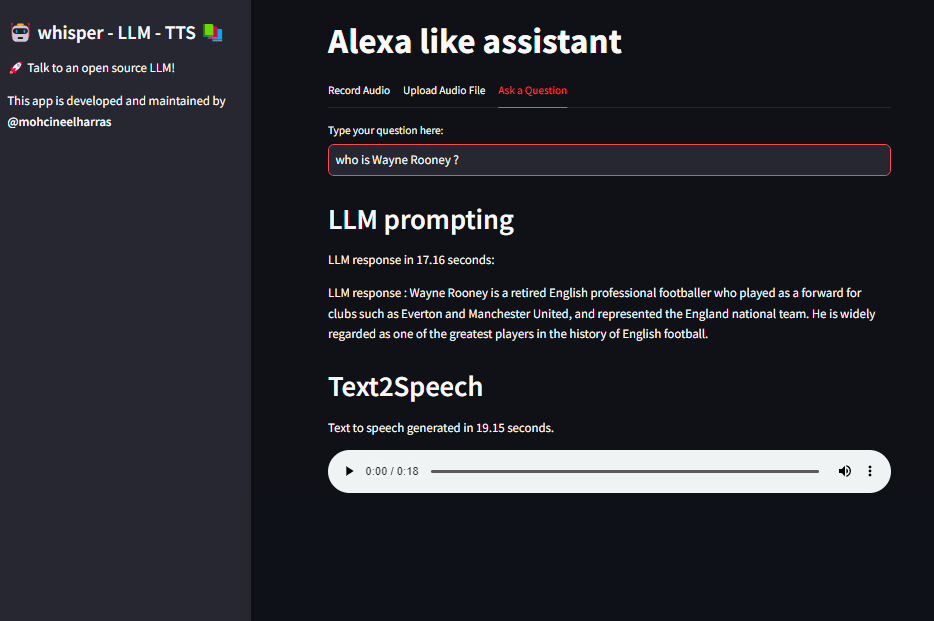
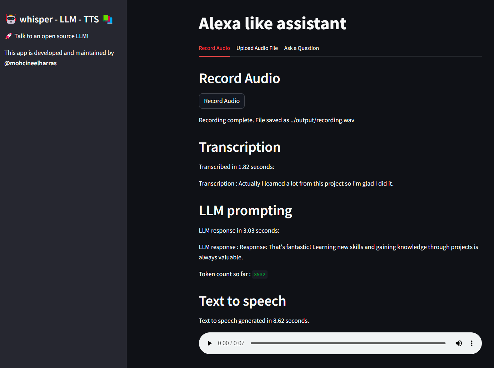

# VoiceAI whisper-llm-gtts

## Overview

VoiceAI integrates the power of Text-to-Speech (TTS), Speech-to-Text (STT), and Local Language Model (LLM) technologies. This advanced AI application enables seamless conversion of text to speech, transcription of audio to text, and interaction with a local language model through an intuitive interface.

## Screenshots

*Here you can include a series of images demonstrating the application in action. Show the user interface, examples of audio transcription, and responses generated by the LLM.*





## System Flowchart

@startuml
actor User
entity "Whisper\n(Speech-to-Text)" as Whisper
entity "LLM\n(Local Language Model)" as LLM
entity "TTS\n(Text-to-Speech)" as TTS

User -> Whisper : speaks into microphone
Whisper -> LLM : transcribed text
LLM -> TTS : processed response
TTS -> User : speaks response
@enduml


## Getting Started

### Prerequisites

Ensure you have the following before proceeding with the installation:

- Python 3.10 or higher
- A GPU for running LLM + Whisper efficiently
- Docker for containerization

### Installation

Clone the project repository :

```bash
git@github.com:mohcineelharras/whisper-llm-gtts.git
cd whisper-llm-gtts
```

Dependencies installation :
```bash
pip install -r requirements_merged.txt
```
```bash
CMAKE_ARGS="-DLLAMA_CUBLAS=on" pip install llama-cpp-python --force-reinstall --upgrade --no-cache-dir
```

If you have got problems with offloading some layers to GPU for acceleration of token generation. try this :
```bash
conda install -c "nvidia/label/cuda-12.1.1" cuda-toolkit
```

### Automatic Environment Setup

For a conventional setup using `conda`, launch `install.sh` located at the root of the project. This script automates creating an env called `audio` and dependencies installation:
```bash
./install.sh
```


## Usage

whisper-llm-gtts provides robust audio and language processing features:


### Running the App

To use whisper-llm-gtts, you need to open two terminals:

- In the first terminal, launch FastAPI:

  ```bash
  conda activate audio
  cd fastapi
  python fastapi/api_server.py
  ```

- In the second terminal, start the Streamlit frontend:

  ```bash
  conda activate audio
  cd streamlit_app
  streamlit run streamlit_app/run app.py
  ```

## Dockerization

The optimal way to run whisper-llm-gtts with Docker is using Docker Compose:

⚠️⚠️⚠️ before building image. Make sure you uncomment docker section in .env file

Afterwards, you have to create a folder names models and download the model you want to use in it

Then, run this command in the root of the project to build and start the containers.

```bash
docker-compose up --build
```


## Technologies & Skills

whisper-llm-gtts is built using a variety of technologies and demonstrates proficiency in numerous skills:

### Libraries

- **FastAPI**: An innovative web framework for building APIs with Python based on standard Python type hints.
- **Streamlit**: An open-source app framework for Machine Learning and Data Science teams.
- **Whisper**: OpenAI's general-purpose speech recognition model for transcribing speech.
- **gTTS (Google Text-to-Speech)**: A Python library and CLI tool to interface with Google Translate's text-to-speech API.
- **PyTorch**: An open-source machine learning library based on the Torch library, used for applications such as computer vision and natural language processing.

### Skills

- **API Development**: Designing and creating robust APIs for efficient communication between different software components.
- **Machine Learning**: Applying models to perform tasks such as speech recognition and language understanding.
- **Full Stack Development**: Implementing both backend and frontend components of the application.
- **Dockerization**: Containerizing applications for ease of deployment and scalability.
- **Audio Processing**: Handling and processing audio data for transcription and speech synthesis.

### Tools

- **Docker & Docker Compose**: For containerizing the application and managing multi-container Docker applications.
- **Git**: For version control and source code management.
- **Uvicorn**: An ASGI server for Python, used to run FastAPI applications.

